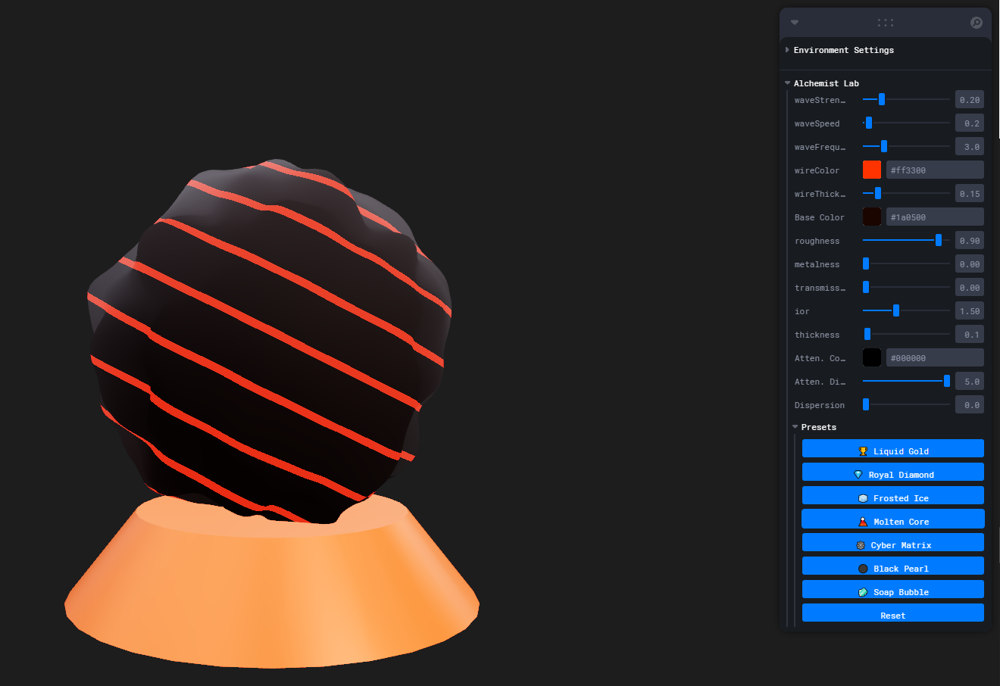

# 🔮 Alchemist Sphere

A cutting-edge procedural material experiment built with **React Three Fiber** and the new **Three.js TSL (Three Shading Language)** system.

This project demonstrates the power of **WebGPU-ready nodes** (`MeshPhysicalNodeMaterial`) to create complex, interactive materials that combine vertex displacement, volumetric attenuation, and chromatic dispersion.

  
  
  

## ✨ Features

- **🌊 Procedural Vertex Displacement:** Real-time noise-based mesh deformation controlled by TSL nodes.
- **💎 Advanced PBR:** Utilizes `transmission`, `ior`, `attenuation`, and `dispersion` for realistic glass and crystal effects.
- **🎛️ Interactive Controls:** Full control over material physics and wave properties via **Leva**.
- **🚀 WebGPU Ready:** Built using `three/tsl` nodes, making it future-proof for the upcoming WebGPU renderer.
- **💾 Instant Presets:** 7 unique material states (Liquid Gold, Cyber Matrix, Frosted Ice, etc.).

## 📸 Presets

The sphere comes with predefined states accessible via the control panel:

| Preset | Description |  
| :--- | :--- | :--- |  
| **🏆 Liquid Gold** | High metalness, warm base, slight wave deformation. |  
| **💎 Royal Diamond** | High refractive index (IOR 2.4), chromatic dispersion. |  
| **🧊 Frosted Ice** | Rough transmission with deep blue attenuation. |  
| **🕸️ Cyber Matrix** | High-frequency noise, digital wireframe, neon emission. |  
| **🌋 Molten Core** | Dark rough rock with glowing internal emissive wireframe. |  

## 🛠️ Tech Stack

- **React**
- **React Three Fiber (R3F)**
- **Three.js** (TSL / Nodes System)
- **Leva** (GUI Controls)

